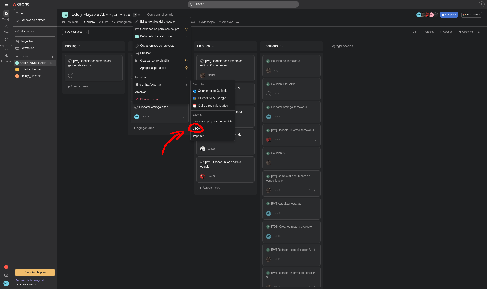

# Asana tasks table maker

This repository contains a script that, given a JSON with Asana tasks and two dates, will create a Word document with a table with the tasks created between the two dates, ordered by completion state.

This script was originally made to help making the iteration reports of the Multimedia Projects assignment in Multimedia Engineering at the University of Alicante. However, you are free to use it and modify it as you please.

# Instructions

## Dependencias

To use this script it's necessary to have Node.js installed. You can download it [here](https://nodejs.org/es/download).

## Export tasks

In your Asana project, select export -> JSON.



Place the file on the project directory. Make sure the file name is `tasks.json`

## Install dependencies

To install the project dependencies use the following command:

```sh
node --run install-prod # nodejs >= 22.0

npm run install-prod
```

## Executing the script

To execute the script use the following command:

```sh
node --run start # nodejs >= 22.0

npm start
```

You will be asked the initial and end date to filter the Asana Tasks that will appear on the table.

If you don't want to use the date filter, leave the dates in blank.

The script will create a Word document named `asanaTasksTable{current_timestamp}.docx`. Timestamp is used to avoid accidental overwriting.

## Update the project

To get the latests changes use the following command:

```sh
node --run check-update # nodejs >= 22.0

npm run check-update
```

# Libraries used

- [docx](https://github.com/dolanmiu/docx): Typescript library to programmatically create Word documents.